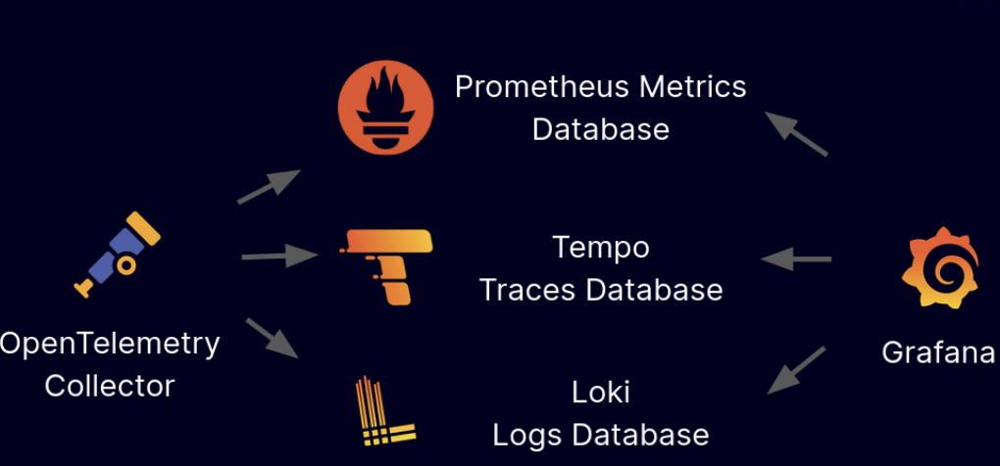

*This project has been created as part of the 42 curriculum by mcutura*

# ft_lgtm

## Description

Looks Good To Monitor (LGTM) is an observability stack for monitoring and alerting, hidden behind a code execution web app.  
Powered by Loki, Grafana, Tempo, Prometheus and Alloy, deployed in a k3d cluster inside a libvirt VM.  

## Features

- Rust code compilation to WASM and execution in the WASI sandbox
- Store and share code snippets on IPFS (InterPlanetary File System)
- Observability stack for Logs, Graphs, Traces, and Metrics. And alerting maybe  

---

  

## Requirements

- libvirt and virt-manager
```
brew install libvirt virt-manager
brew services start libvirt
```

## Instructions

- `make auto` for automated setup and deploy (approx ~5-10 mins)  
- `make help` to display all available commands  

## Usage

### Grafana

- Access Grafana at [http://grafana.lgtm.local:8080](http://grafana.lgtm.local:8080)  
- `make secret` to get Grafana admin password  

- Add data sources:
  - Loki: http://loki.lgtm.svc.cluster.local:3100
  - Tempo: http://tempo.lgtm.svc.cluster.local:3200
  - Prometheus: http://prometheus-server.lgtm.svc.cluster.local:80

TODO: Import Dashboards section

### Code execution app

Access the code execution app at [http://lgtm.local:8080](http://lgtm.local:8080)  


## Technical choices

TODO: explain myself

## Resources

##### WASM

[https://webassembly.org/](https://webassembly.org/)  
[https://docs.wasmtime.dev/api/wasmtime/index.html](https://docs.wasmtime.dev/api/wasmtime/index.html)  
[https://doc.rust-lang.org/nightly/rustc/platform-support/wasm32-wasip2.html](https://doc.rust-lang.org/nightly/rustc/platform-support/wasm32-wasip2.html)  
[https://github.com/bytecodealliance/wasmtime](https://github.com/bytecodealliance/wasmtime)  

##### Svelte

[https://svelte.dev/docs/svelte/overview](https://svelte.dev/docs/svelte/overview)  

##### IPFS

[https://docs.ipfs.tech/](https://docs.ipfs.tech/)  
[https://github.com/ipfs/kubo](https://github.com/ipfs/kubo)  

##### LGTM

[https://grafana.com/docs/loki/latest/](https://grafana.com/docs/loki/latest/)  
[https://grafana.com/docs/grafana/latest/](https://grafana.com/docs/grafana/latest/)  
[https://grafana.com/docs/tempo/latest/](https://grafana.com/docs/tempo/latest/)  
[https://prometheus.io/docs/introduction/overview/](https://prometheus.io/docs/introduction/overview/)  
[https://grafana.com/docs/alloy/latest/](https://grafana.com/docs/alloy/latest/)  
[https://github.com/grafana-community/helm-charts](https://github.com/grafana-community/helm-charts)
